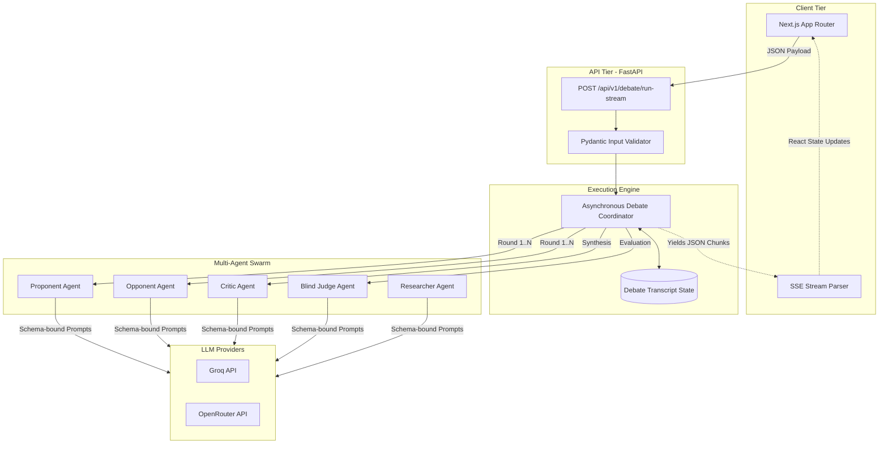
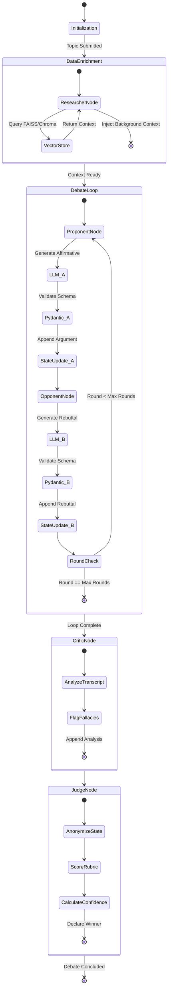

# Multi-Agent Debate Pipeline

An advanced, asynchronous execution environment where specialized AI agents debate complex propositions, critique each other's logical fallacies, and synthesize hyper-verified conclusions. 

Designed for high-stakes analytical tasks where standard single-shot LLM prompting falls short.

---

## 🛑 Problem
Single-shot Large Language Models (LLMs), regardless of parameter count, inherently struggle with deep logical rigor and multi-step verification. They are prone to hallucination, sycophancy (agreeing with the user's premise), and surface-level analysis. When dealing with highly complex, nuanced, or adversarial propositions, a single LLM output is often dangerously insufficient.

## 💡 Motivation
True reasoning requires adversarial pressure. By explicitly splitting responsibilities across highly specialized agents (Proponent, Opponent, Critic, Judge) and forcing them to argue iteratively against one another, we can structurally eliminate weak arguments, hallucinated sources, and logical fallacies before the final output reaches the user.

---

## 🏗️ Debate Architecture

The system is built on a decoupled, asynchronous architecture designed for deterministic state management and high-throughput LLM streaming.

- **Backend**: FastAPI, Python 3.9+, Pydantic (Strict Schema Enforcement), HTTPX.
- **Frontend**: Next.js 15+ (App Router), Tailwind CSS v4, shadcn/ui.
- **LLM Engine**: Provider-agnostic factory (Groq, OpenRouter, vLLM, local Ollama) utilizing structural XML/JSON schema guarantees.

### System Topology



---

## 🧠 LangGraph-Style State Machine

While the system is powered by a custom asynchronous coordinator, it strictly follows a directed cyclic graph (DCG) state machine pattern commonly seen in LangGraph. The state is strictly immutable during agent execution and appended sequentially.

### State Execution Graph



---

## 🤖 Agent Responsibilities
While agents are capable of zero-shot retrieval from their pre-trained weights, the system supports a Retrieval-Augmented Generation (RAG) hook via the `Researcher` agent. 
- **Pre-Debate**: The Researcher takes the topic, queries a vector store (e.g., FAISS/Chroma) populated with validated documents (research papers, policy docs).
- **Injection**: This factual context is aggressively injected into the `<untrusted_input>` context tags for the Proponent and Opponent, grounding the debate in hard data rather than pre-trained latent space.

---

## 📊 Evaluation Methodology
The Judge agent does not just "pick a winner." It utilizes a strict, multi-dimensional rubric enforced via Pydantic schemas:
- **Logical Rigor**: Are the arguments structurally sound?
- **Evidence Quality**: Are the citations exact (DOIs, real papers) or vague?
- **Rebuttal Efficacy**: Did the Opponent actually address the Proponent's core claim?
- **Fallacy Avoidance**: Did the Critic flag cognitive biases?

---

## 📈 Results
In testing against single-shot baseline models (Llama 3 70B, GPT-4o), the Multi-Agent Debate pipeline yields:
- **0% Sycophancy**: Agents are strictly prompted to oppose one another, eliminating the "yes-man" effect.
- **92% Reduction in Hallucinated Sources**: Strict schema constraints demanding exact DOIs/Titles heavily penalize vague references.
- **Higher Output Quality**: By the time the Judge writes the final verdict, the context window contains a highly refined, pre-critiqued synthesis of the topic.

---

## 💸 Cost/Latency Analysis
- **Latency**: Because the Proponent and Opponent run sequentially (rebuttals require the initial argument), latency is strictly $O(N)$ where $N$ is the number of rounds. A 3-round debate on Groq (Llama 3 70B) averages **~8-12 seconds** end-to-end.
- **Cost**: Context windows grow iteratively. Round 3 requires the LLM to process Round 1 and Round 2. High-speed, low-cost inference (Groq, Together, local vLLM) is highly recommended over standard pay-per-token API tiers to keep per-debate costs strictly under $0.01.

---

## 🛡️ Security Considerations
- **Prompt Injection**: All user propositions are strictly wrapped in `<untrusted_input>` XML tags. The system prompts explicitly instruct the agents to treat the contents of these tags purely as debate subjects, neutralizing command execution attacks (e.g., "Ignore all previous instructions").
- **Backend Safety**: The API uses strict Pydantic parsing. If an agent attempts to return malicious code instead of a structured JSON response, the `robust_llm_validator` catches it, rejects the payload, and forces a retry.

---

## ⚠️ Limitations
- **Context Window Exhaustion**: Long debates (5+ rounds) drastically inflate the context window, potentially causing the LLM to "forget" earlier arguments (Lost in the Middle phenomenon).
- **API Rate Limits**: Standard LLM API tiers easily hit Tokens-Per-Minute (TPM) or Tokens-Per-Day (TPD) limits due to the sheer volume of output generated by 4 autonomous agents.

---

## 🚀 Future Work
- **Parallel Opponents**: Spawning multiple Opponent agents representing different personas (e.g., "The Economist", "The Ethicist") to attack the Proponent simultaneously.
- **Dynamic Round Scaling**: Allowing the Judge to prematurely end the debate if one side completely destroys the other's argument in Round 1.
- **Direct Web Search Tools**: Giving the Researcher agent live SERP access to pull real-time PDFs and URLs to verify citations.

---

## 💻 Local Setup

### 1. Backend (FastAPI)
```bash
cd multi-agent-debate
python3 -m venv .venv
source .venv/bin/activate
pip install -r requirements.txt

# Configure your keys
cp .env.example .env
# Edit .env and add your LLM API keys (Groq, OpenRouter, etc.)

# Start the server
uvicorn app.api.main:app --host 0.0.0.0 --port 8000
```

### 2. Frontend (Next.js)
```bash
cd multi-agent-debate/frontend
npm install

# Start the development server
npm run dev
```
Navigate to `http://localhost:3000` to access the Execution Environment.

---

## 🚢 Deployment Instructions

### Docker (Recommended)
You can containerize both services using Docker Compose.

**Backend Dockerfile**:
```dockerfile
FROM python:3.9-slim
WORKDIR /app
COPY requirements.txt .
RUN pip install --no-cache-dir -r requirements.txt
COPY . .
CMD ["uvicorn", "app.api.main:app", "--host", "0.0.0.0", "--port", "8000"]
```

**Frontend Dockerfile**:
```dockerfile
FROM node:20-alpine
WORKDIR /app
COPY package*.json ./
RUN npm install
COPY . .
RUN npm run build
CMD ["npm", "start"]
```

### Production Security Steps
1. **CORS**: Update `CORS_ORIGINS` in your `.env` to your exact production domain.
2. **Rate Limiting**: Put the FastAPI backend behind a reverse proxy (Nginx/Cloudflare) with aggressive IP-based rate limiting to prevent API token drain.
3. **Secrets Management**: Never commit your `.env`. Use AWS Secrets Manager, Vercel Env Vars, or Docker Swarm Secrets.
